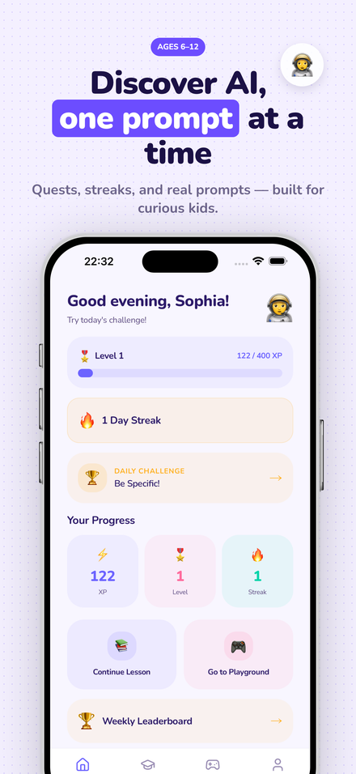
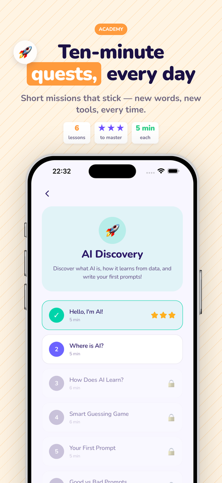
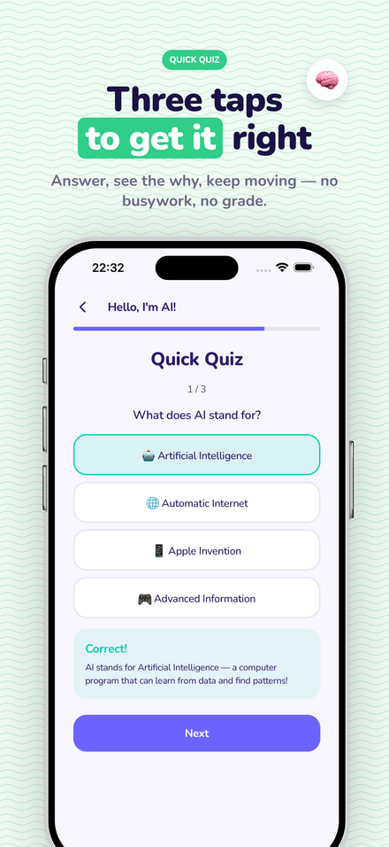
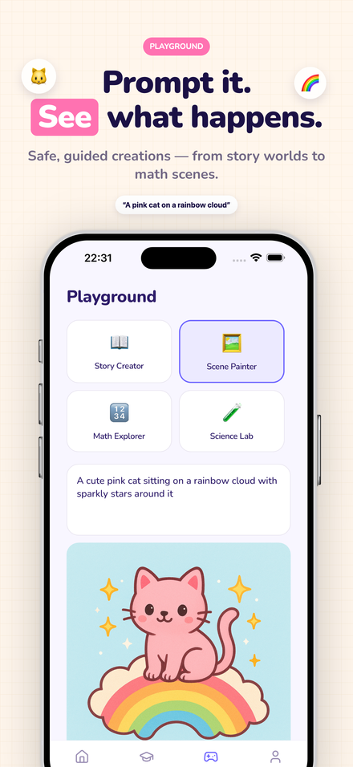
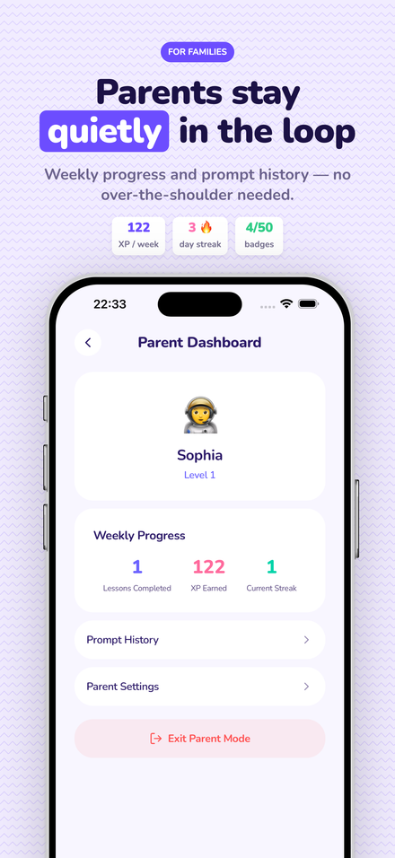

# react-shot

**Create store screenshots with React. Built for AI agents.**

Preview in the browser, export production-ready PNGs. One composition renders iPhone 6.9" and iPad 13" without a second pass of padding tweaks.

[**Live demo →**](https://react-shot.codixus.dev) · [Docs](https://react-shot.codixus.dev/docs) · [GitHub](https://github.com/codixus/react-shot)

<p align="center">
  
  
  
  
  
</p>

<p align="center"><sub>PromptJr composition, exported in one command.</sub></p>

## What it unlocks

- **Localize in seconds.** Ask your agent to translate every slice into a new locale — it edits the copy, you re-export.
- **Iterate without design debt.** Try five headline variations, pick the winner. Copy lives in TS — diffs are readable.
- **One file, every device.** iPhone 6.9" and iPad 13" render from the same composition; typography stays proportional.
- **Store-ready PNGs.** Puppeteer + Sharp slice straight to App Store Connect / Play Console dimensions.
- **Ship a story, not a gallery.** The bundled skill enforces Hook · Shift · Proof · Delivery · Payoff so copy carries the sale.
- **Agent-first authoring.** Claude Code and friends pick the right primitives automatically via the bundled skill.
- **Patterns out of the box.** Eleven tile-able backgrounds (dots, grid, zigzag, waves…) mix for a set that feels like a set.
- **Brand refresh in a commit.** Change a token, every slice updates — no round-trips, no stale exports.

## Install

```bash
bun add react-shot
```

Requires Bun ≥ 1.1, Node ≥ 22, FFmpeg (optional, for video export).

## Quick Start

```bash
mkdir my-screenshots && cd my-screenshots
bunx react-shot init
bun install

cp ~/simulator-screenshots/*.png public/assets/screenshots/ios/

bun run dev                                # preview locally at :5174
bunx react-shot export hero --all --store  # render + slice PNGs
```

After `bun run dev`, the Gallery lists every composition, a **Docs** link opens an in-browser how-to page, and each preview has a theme toggle (light / dark) that persists across routes.

## The Primitives

Eleven components — the whole user-facing API.

| Primitive                                 | Purpose                                                               |
| ----------------------------------------- | --------------------------------------------------------------------- |
| `Canvas`                                  | Root. Takes a preset, a device variant, slice count.                  |
| `Slice`                                   | One screenshot. Flex column with optional bg + deco.                  |
| `Region`                                  | Vertical zone inside a Slice (top / middle / bottom).                 |
| `Device`                                  | Auto-fits the chosen device frame to the region.                      |
| `Bg`                                      | Background layer: solid / gradient / image / mesh / pattern.          |
| `Shape`                                   | Decorative blob / circle / ring / pill.                               |
| `Card`                                    | Overlay surface with `glass` / `float` / `neon` / `outline` variants. |
| `Title`, `Subtitle`, `Eyebrow`, `Caption` | Token-scaled typography.                                              |
| `Highlight`                               | Inline text decorator (underline, pill, italic, stroke, color).       |
| `Positioned`, `Stack`, `Row`              | Layout helpers.                                                       |

Typography and spacing come from `tokens`, which derive from the _device width_ (not the slice width). That's why iPhone and iPad output feel the same size — the phone on screen is the visual anchor.

## Bg patterns

`<Bg>` accepts eleven one-shot backgrounds:

```tsx
<Bg solid="#F7F6F1" />
<Bg gradient={{ colors: ["#000", "#333"] }} />
<Bg mesh={{ colors: ["#f00","#0f0","#00f","#ff0"] }} />
<Bg image={{ src: "/hero.jpg" }} />
<Bg noise={{ base: "#F5F3EE", intensity: 0.06 }} />
<Bg dots={{ bg: "#fff", color: "#000" }} />
<Bg grid={{ bg: "#fff", color: "#000" }} />
<Bg stripes={{ bg: "#fff", color: "#f00", angle: 45 }} />
<Bg zigzag={{ bg: "#fff", color: "#000" }} />
<Bg waves={{ bg: "#fff", color: "#000" }} />
<Bg diagonal={{ colors: ["#111", "#fff"] }} />
```

Pick one per slice. Vary across slices so the set reads as a set.

## Writing a Composition

```tsx
import type { CompositionProps } from "react-shot";
import {
  Canvas,
  Slice,
  Region,
  Device,
  Bg,
  Title,
  Subtitle,
  Eyebrow,
  Highlight,
} from "react-shot";
import { appstore, appstoreIPad } from "react-shot/presets";

export default function Hero({ device = "iphone-16-pro" }: CompositionProps) {
  const preset = device === "ipad-pro-13" ? appstoreIPad : appstore;

  return (
    <Canvas preset={preset} device={device} slices={5}>
      <Slice index={0} bg={<Bg dots={{ bg: "#F7F6F1", color: "#D8D4C3" }} />}>
        <Region anchor="middle">
          <Eyebrow tone="accent" accentColor="#3D3BFF">
            Flast
          </Eyebrow>
          <Title color="#0A0A0A">
            Your AI,
            <br />
            one simple{" "}
            <Highlight variant="color" color="#3D3BFF">
              chat.
            </Highlight>
          </Title>
          <Subtitle color="rgba(10,10,10,0.6)">
            Ask, plan, research, ship — without switching tabs.
          </Subtitle>
        </Region>

        <Region anchor="bottom" overflow={0.12}>
          <Device screenshot="/assets/screenshots/flast/chat.png" />
        </Region>
      </Slice>

      {/* …more slices… */}
    </Canvas>
  );
}
```

Notable ideas:

- **Slice count is a prop**, not a preset. `<Canvas slices={4}>` and `<Canvas slices={6}>` both work with the same `appstore` preset.
- **Regions auto-fill remaining space.** `anchor="middle"` takes `flex: 1` and centers content; middle regions auto-reserve `tokens.space.lg` bottom padding so stat rails don't kiss the device below.
- **`overflow` lets a device extend past its region.** A phone at `anchor="bottom" overflow={0.12}` bleeds 12% below the safe area.
- **Tokens scale from `deviceWidth`.** A `<Title>` on iPhone and on iPad look the same size relative to the device next to them.

## Copy rules

Every slice follows the same rhythm — eyes glide, they don't jump:

- **Title**: fixed 2 lines, 4–7 words total. Action verb on line 1, outcome on line 2. Line 2 carries a `<Highlight>`.
- **Subtitle**: fixed 1 line, 50–80 characters. Benefit-first. Parallel structure across slices.
- **Eyebrow**: 1–3 words. Category, stat, or persona.

See the in-browser **Docs** page (`/docs`) or [`skills/react-shot/references/copy-rules.md`](./skills/react-shot/references/copy-rules.md) for examples and rewrites.

## Registering a Composition

```ts
import { lazy } from "react";
import type { CompositionEntry } from "react-shot/types";
import { appstore, appstoreIPad } from "react-shot/presets";

export const compositions: CompositionEntry[] = [
  {
    id: "hero",
    name: "Hero",
    component: lazy(() => import("./hero")),
    preset: appstore,
    ipadPreset: appstoreIPad,
    slices: 5, // any count; preset is agnostic
    device: "iphone-16-pro",
    locales: ["en", "tr"],
    family: "ai-assistant",
  },
];
```

## Localize in seconds

Every composition is a React component, so copy lives in plain TypeScript. Ask your agent to translate it, list the locales in the registry, and export everything in one command.

**1 · Make the copy locale-aware.** A tiny map is usually enough:

```tsx
import type { CompositionProps } from "react-shot";
import { Canvas, Slice, Region, Device, Bg, Title, Subtitle, Eyebrow, Highlight } from "react-shot";
import { appstore } from "react-shot/presets";

const copy = {
  en: { eyebrow: "Your AI companion", title: ["Honest AI,", "one simple chat."], subtitle: "Feedback you can act on, not validation." },
  tr: { eyebrow: "AI yol arkadaşın", title: ["Dürüst AI,", "tek bir sohbette."], subtitle: "İşe yarayan geri bildirim, boş onay değil." },
  es: { eyebrow: "Tu compañero de IA", title: ["IA honesta,", "un solo chat."], subtitle: "Feedback accionable, no validación vacía." },
  ja: { eyebrow: "あなたのAIコンパニオン", title: ["率直なAI、", "シンプルな対話。"], subtitle: "役に立つフィードバック、ただの肯定ではなく。" },
} as const;

export default function Hero({ locale = "en" }: CompositionProps) {
  const t = copy[locale as keyof typeof copy] ?? copy.en;
  return (
    <Canvas preset={appstore} slices={5}>
      <Slice index={0} bg={<Bg dots={{ bg: "#F8F8F7", color: "#D0D0D0" }} />}>
        <Region anchor="middle">
          <Eyebrow tone="dark">{t.eyebrow}</Eyebrow>
          <Title>{t.title[0]}<br /><Highlight variant="pill" color="#000">{t.title[1]}</Highlight></Title>
          <Subtitle>{t.subtitle}</Subtitle>
        </Region>
        <Region anchor="bottom" overflow={0.12}><Device /></Region>
      </Slice>
      {/* …more slices, same shape */}
    </Canvas>
  );
}
```

**2 · List the locales in the registry.**

```ts
{
  id: "hero",
  component: lazy(() => import("./hero")),
  preset: appstore,
  locales: ["en", "tr", "es", "ja"],
}
```

**3 · Export every locale in one shot.**

```bash
# every locale, one device
bunx react-shot export hero --all-locales

# every locale × ios + ipad, into store-ready folders
bunx react-shot export hero --all --store
```

Output drops to `appstore/<locale>/APP_IPHONE_67/01.png…NN.png`, ready for fastlane / App Store Connect upload.

**Agent workflow:** ask once, ship many.

> _"Localize the hero composition to Turkish, Spanish, and Japanese. Follow the copy rules: no em dashes, title 2 lines, subtitle 1 line, 50–80 chars."_

The bundled [skill](./skills/react-shot/) teaches the agent the copy rules so the translations stay on-brand — and once the registry lists the locales, `bunx react-shot export <id> --all --store` does the rest.

## Presets

```ts
import {
  appstore,
  appstoreIPad,
  playstore,
  socialInstagram,
  socialTwitter,
} from "react-shot/presets";
```

A preset carries `{ width, height, safeArea }` only. `<Canvas slices={N}>` handles horizontal stacking.

## Device Variants

`iphone-16-pro`, `ipad-pro-13`, `ipad-mini`, `macbook-pro`, `apple-watch`, `android-phone`, `pixel`, `galaxy`, `browser`, `desktop`, `vision-pro`, `tv`.

Pass via `<Canvas device="…">` or per-instance `<Device variant="…" />`.

## CLI

```bash
react-shot init                # scaffold a project
react-shot dev                 # preview in browser
react-shot export <id>         # single locale, single device
react-shot export <id> --locale tr
react-shot export <id> --device ipad
react-shot export <id> --all   # every locale × device
react-shot export <id> --store # output under deviceFolders/
```

## Config

```ts
import { defineConfig } from "react-shot/config";

export default defineConfig({
  compositionsDir: "./compositions",
  publicDir: "./public",
  port: 5174,
  export: {
    outputDir: "./appstore",
    deviceFolders: {
      ios: "APP_IPHONE_67",
      ipad: "APP_IPAD_PRO_6GEN_129",
    },
  },
});
```

## Included demo compositions

The demo ships six reference sets that cover the common story shapes:

- **PromptJr** — AI learning for kids, playful sticker + badge style.
- **Flast** — AI assistant, paper-first and typographic.
- **Transit Pulse** — signage-style utility with route pills.
- **Creator Captions** — magazine-bold + a device-less preset grid slice.
- **Playful Gifting** — pink e-commerce with emoji stickers.
- **Quiet Premium** — minimalist, device-top / text-bottom flip.

## Theme

The Gallery, Docs page, and Viewport chrome follow a shared light / dark toggle (persisted in `localStorage`, respects `prefers-color-scheme`). The toggle is exposed as:

```tsx
import { ThemeToggle, useChromeTheme } from "react-shot";
```

## AI agent skill

For Claude Code / compatible agents, the SDK ships a skill under [`skills/react-shot/`](./skills/react-shot/). Copy it to `~/.claude/skills/react-shot/` (or symlink) and your agent will follow the composition skeleton, copy rules, and Bg pattern conventions automatically.

## Scripts

```bash
bun run dev         # preview + gallery
bun test            # unit + render smoke tests
bun run typecheck   # tsc --noEmit
bun run build       # build the lib
```

## License

MIT — see [LICENSE](./LICENSE).
